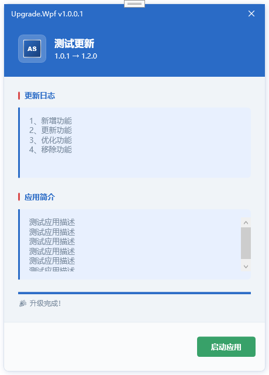
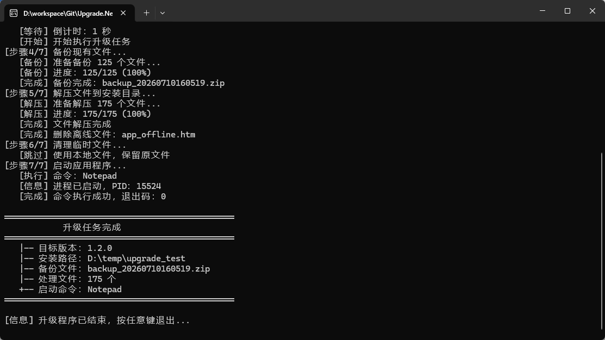

# Upgrade.Net

An application upgrade program based on .NET, supporting both console and WPF versions, providing complete download, backup, decompression, and launch processes.

## Project Introduction

Upgrade.Net is a lightweight Windows application upgrade solution that supports downloading update packages from remote servers and automatically completing version upgrades. The project includes two versions:

- **Upgrade.Net**: Console version, suitable for background silent upgrade scenarios
- **Upgrade.Wpf**: WPF UI version, providing visual upgrade progress and user interaction

## Features

- **Multiple Installation Modes**: Support installation from local ZIP files, remote URLs, or automatic mode
- **File Backup**: Support automatic backup of existing files before upgrade, configurable backup path
- **Ignore Files**: Support specifying a list of files to ignore during upgrade
- **Offline Mode**: Support copying offline display files and setting countdown
- **Auto Launch**: Support automatically launching the main program after upgrade, including `dotnet` command support
- **Progress Display**: Real-time display of download, backup, and decompression progress and status information
- **Pause/Cancel**: WPF version supports download pause, resume, and cancel functions
- **Configuration File**: Support JSON format upgrade configuration file

## Screenshots

| Version | Screenshot |
|---------|------------|
| WPF Version |  |
| Console Version |  |

## Software Architecture

### Console Version (Upgrade.Net)

- **Target Framework**: .NET 10.0
- **Output Type**: Console Application
- **Network Requests**: HttpClient (static reuse)
- **Data Exchange**: System.Text.Json

### WPF Version (Upgrade.Wpf)

- **Target Framework**: .NET 10.0-windows
- **Output Type**: WPF Desktop Application
- **Architecture Pattern**: MVVM
- **Network Requests**: HttpClient (static reuse)
- **Data Exchange**: System.Text.Json
- **UI Style**: China Blue theme, borderless window design

### Core Modules

| Module | Description |
|--------|-------------|
| Upgrade | Upgrade core logic class (Console version) |
| UpgradeWindow | Upgrade window, handling download, decompression, restart logic (WPF version) |
| MainWindow | Main window (WPF version) |
| SplashWindow | Splash screen window (WPF version) |
| UpgradeConfig | Upgrade configuration management class |
| LaunchConfig | Launch configuration |
| BackupConfig | Backup configuration |
| OfflineConfig | Offline configuration |
| ScmAppInfo | Application information DTO |
| ScmVerInfo | Version information DTO |
| MainWindowDvo | Main window data binding object (WPF version) |

## Configuration File

### upgrade.json

```json
{
  "title": "Application Update",
  "installPath": "D:\\app",
  "installType": "Auto",
  "installFile": "D:\\local\\update.zip",
  "downloadUrl": "http://example.com/update.zip",
  "autoClose": true,
  "ignoreFiles": ["log", "temp", "database"],
  "launch": {
    "command": "dotnet MyApp.dll",
    "args": "--environment Production"
  },
  "backup": {
    "path": "D:\\backup"
  },
  "offline": {
    "file": "D:\\offline\\offline.html",
    "time": 10
  },
  "appInfo": {
    "types": 0,
    "code": "app_code",
    "name": "Application Name",
    "content": "Application Description"
  },
  "verInfo": "Version update description content with auto-scroll support"
}
```

### Configuration Fields

| Field | Type | Required | Description |
|-------|------|----------|-------------|
| title | string | No | Display title of the upgrade program |
| installPath | string | Yes | Installation path of the application to be upgraded |
| installType | string | No | Installation mode: Auto/FromZip/FromUrl, default Auto |
| installFile | string | No | Local installation file path (required for FromZip mode) |
| downloadUrl | string | Yes | Remote download URL (required for FromUrl mode) |
| autoClose | bool | No | Whether to close the updater after upgrade, default true |
| ignoreFiles | array | No | List of files to ignore during upgrade |
| launch.command | string | No | Launch command, supports: `MyApp.exe`, `dotnet MyApp.dll`, `"C:\Program Files\MyApp.exe"` |
| launch.args | string | No | Launch arguments, appended to the command |
| backup.path | string | No | Backup file path |
| offline.file | string | No | Offline display file path |
| offline.time | int | No | Offline file countdown in seconds |
| verInfo | string | No | Version upgrade description (displayed in WPF version) |

### InstallType Options

| Value | Description |
|-------|-------------|
| Auto | Auto mode, use local file first, download from URL if not found |
| FromZip | Use local ZIP file only |
| FromUrl | Download from remote URL only |

### Launch.Command Supported Formats

| Format | Example | Description |
|--------|---------|-------------|
| Simple Command | `"MyApp.exe"` | Directly launch executable |
| .NET App | `"dotnet MyApp.dll"` | Launch via dotnet command |
| With Arguments | `"dotnet MyApp.dll --port 5000"` | Command with arguments |
| Full Path | `"C:\\Program Files\\MyApp.exe"` | Full path with quotes |

## Usage

### Configure Upgrade Settings

1. Edit `upgrade.json` configuration file
2. Set `installPath` to the application installation directory
3. Configure `downloadUrl` as the upgrade file download URL
4. Set `launch`, `backup`, `offline` options as needed

### Run the Upgrade Program

#### Console Version

```bash
cd Upgrade.Net
dotnet run
```

#### WPF Version

```bash
cd Upgrade.Wpf
dotnet run
```

### Control Buttons (WPF Version)

- **Start**: Start the upgrade process
- **Pause**: Pause current download
- **Cancel**: Cancel upgrade and exit

## Upgrade Flow

```
1. Prepare installation directory
2. Get installation file (local file or remote download)
3. Copy offline file (optional)
4. Backup existing files (optional)
5. Extract files to installation directory
6. Clean up temporary files
7. Launch application
```

### Flow Details

| Step | Name | Description |
|------|------|-------------|
| 1 | Prepare Installation Directory | Create or verify installation directory exists |
| 2 | Get Installation File | Get ZIP file from local or remote based on InstallType |
| 3 | Copy Offline File | Copy offline.html to installation directory |
| 4 | Backup Existing Files | Package and backup all files in installation directory |
| 5 | Extract Files | Extract ZIP files to installation directory, ignore specified files |
| 6 | Clean Up Temporary Files | Delete downloaded temporary ZIP file |
| 7 | Launch Application | Execute launch.command to start the main program |

## Project Structure

```
Upgrade.Net/
├── Upgrade.Net/              # Console Version
│   ├── Config/
│   │   └── UpgradeConfig.cs  # Configuration Management
│   ├── Dto/
│   │   ├── ScmAppInfo.cs     # Application Information
│   │   └── ScmVerInfo.cs     # Version Information
│   ├── Resources/
│   │   └── logo.ico          # Application Icon
│   ├── Program.cs            # Program Entry
│   ├── Upgrade.cs            # Upgrade Core Logic
│   ├── upgrade.json          # Configuration File
│   └── Upgrade.Net.csproj    # Project File
├── Upgrade.Wpf/              # WPF Version
│   ├── Config/
│   │   └── UpgradeConfig.cs  # Configuration Management
│   ├── Dto/
│   │   ├── ScmAppInfo.cs     # Application Information
│   │   └── ScmVerInfo.cs     # Version Information
│   ├── Dvo/
│   │   └── MainWindowDvo.cs  # Data Binding Object
│   ├── Resources/
│   │   └── logo.ico          # Application Icon
│   ├── App.xaml              # Application Entry (Resource Dictionary)
│   ├── MainWindow.xaml       # Main Window
│   ├── UpgradeWindow.xaml    # Upgrade Window
│   ├── SplashWindow.xaml     # Splash Screen
│   ├── upgrade.json          # Configuration File
│   └── Upgrade.Wpf.csproj    # Project File
├── .gitignore
├── LICENSE
├── README.md
├── README.en.md
└── Upgrade.Net.slnx          # Solution File
```

## Requirements

- .NET 10.0+
- Windows 7 or later
- Console encoding support: GBK/UTF-8

## Contribution

1. Fork the repository
2. Create Feat_xxx branch
3. Commit your code
4. Create Pull Request

## License

This project is licensed under the MIT License.
