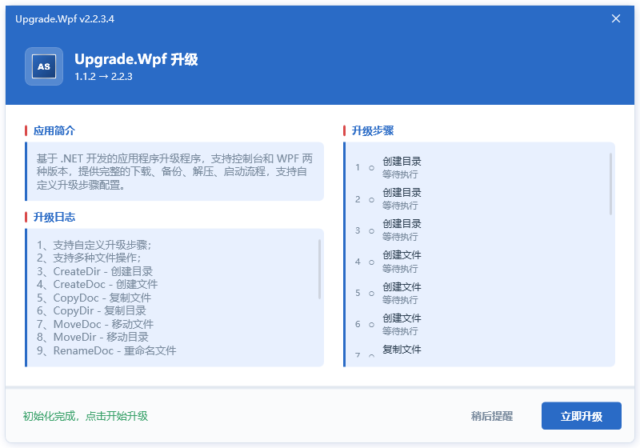
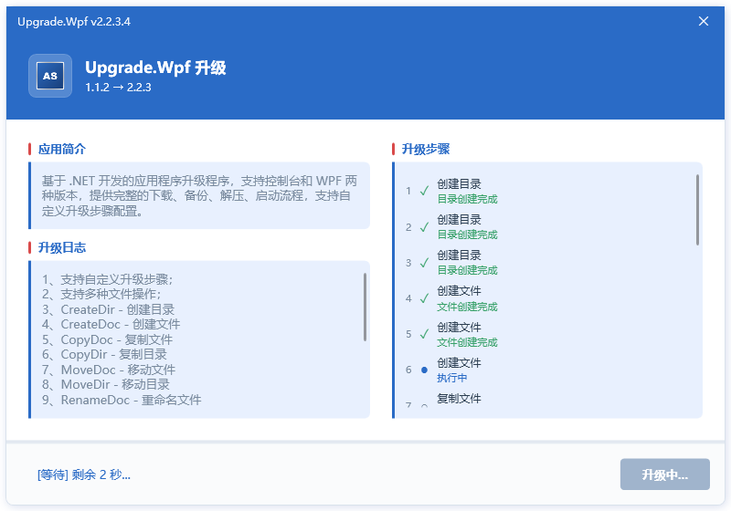
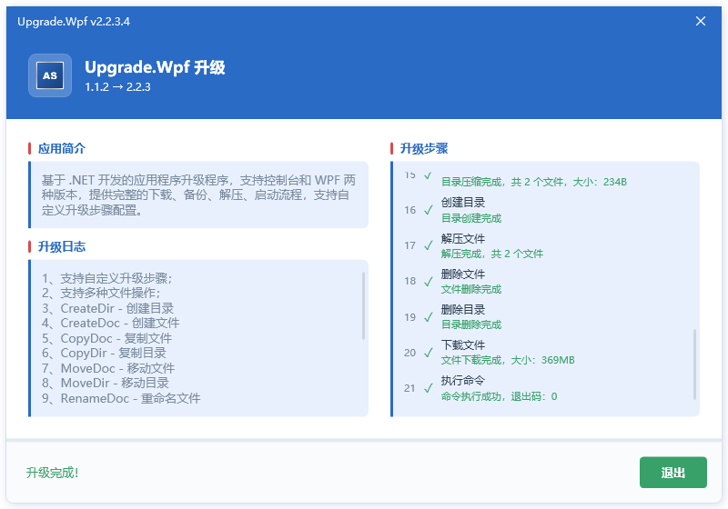
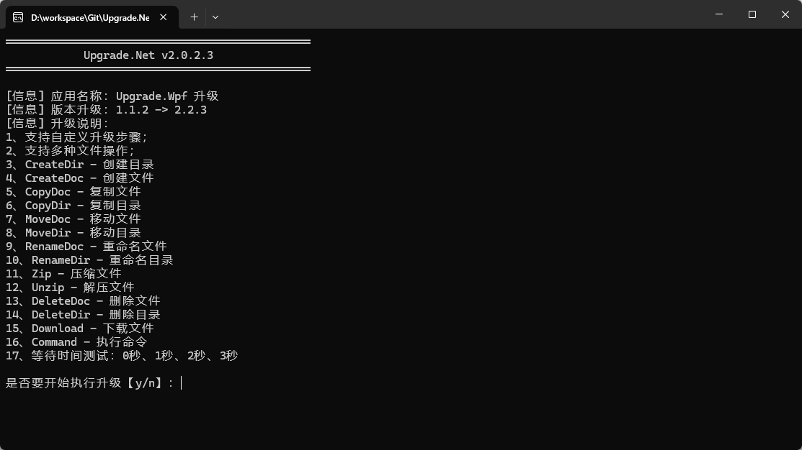
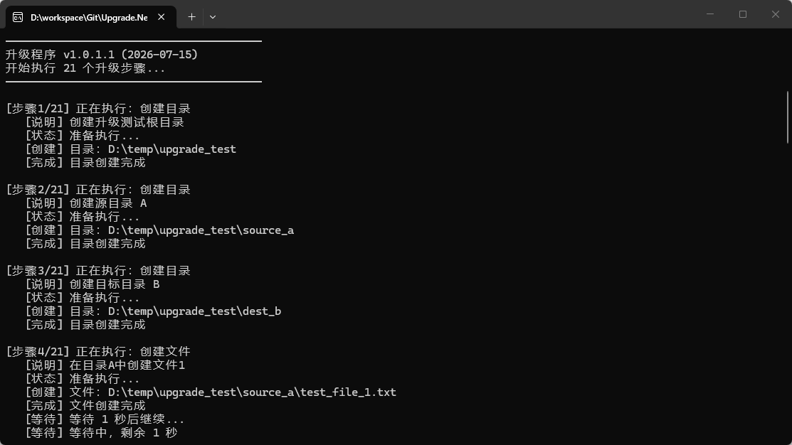
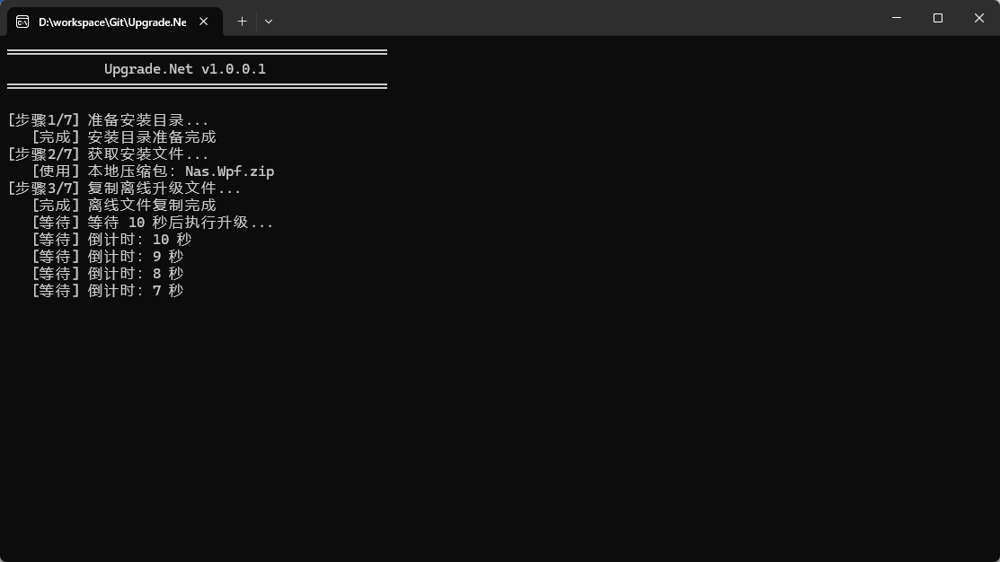

# Upgrade.Net

基于 .NET 开发的应用程序升级程序，支持控制台和 WPF 两种版本，提供完整的下载、备份、解压、启动流程，支持自定义升级步骤配置。

## 项目简介

Upgrade.Net 是一个轻量级的 Windows 应用程序升级解决方案，支持从远程服务器下载更新包并自动完成版本升级。项目包含两个版本：

- **Upgrade.Cmd**：控制台版本，适合后台静默升级场景
- **Upgrade.Wpf**：WPF 界面版本，提供可视化升级进度和用户交互

## 功能特性

- **自定义升级步骤**：支持通过 JSON 配置文件定义动态升级步骤序列
- **15种操作类型**：下载、命令执行、压缩、解压、移动、复制、创建、删除、更名等
- **等待时间**：每个步骤可配置等待时间，支持倒计时显示
- **重试机制**：支持配置重试次数和重试延迟
- **自动启动**：支持升级完成后自动启动主程序，支持 `dotnet` 命令启动
- **进度显示**：实时显示下载、备份、解压进度和状态信息
- **暂停/取消**：WPF 版本支持下载暂停、继续、取消功能
- **配置文件**：支持 JSON 格式的升级配置文件

## 界面截图

| 版本 | 界面截图 |
|------|----------|
| WPF 版本 |  |
| WPF 版本 |  |
| WPF 版本 |  |
| 控制台版本 |  |
| 控制台版本 |  |
| 控制台版本 |  |

## 软件架构

### 控制台版本 (Upgrade.Net)

- **目标框架**：.NET 10.0
- **输出类型**：控制台应用程序
- **网络请求**：HttpClient（静态复用）
- **数据交换**：System.Text.Json

### WPF 版本 (Upgrade.Wpf)

- **目标框架**：.NET 10.0-windows
- **输出类型**：WPF 桌面应用程序
- **架构模式**：MVVM
- **网络请求**：HttpClient（静态复用）
- **数据交换**：System.Text.Json
- **界面风格**：中国蓝主题，无边框窗口设计

### 核心模块

| 模块 | 说明 |
|------|------|
| Upgrade | 升级核心逻辑类（控制台版本） |
| UpgradeWindow | 升级窗口，处理下载、解压、重启逻辑（WPF版本） |
| MainWindow | 主窗口（WPF版本） |
| SplashWindow | 启动窗口（WPF版本） |
| UpgradeConfig | 升级配置管理类 |
| StepConfig | 步骤配置类 |
| UpgradeAction | 升级操作类（策略模式） |
| UpgradeOption | 操作类型枚举 |
| ScmAppInfo | 应用信息 DTO |
| ScmVerInfo | 版本信息 DTO |

## 配置文件说明

### upgrade.json

```json
{
  "icon": "your_icon.ico",
  "title": "your_app_title",
  "oldVersion": "1.0.0",
  "newVersion": "2.0.0",
  "autoStart": true,
  "autoClose": false,
  "showSteps": true,
  "appInfo": "应用描述信息，支持较长文本自动滚动",
  "verInfo": "版本升级说明，支持较长文本自动滚动",
  "steps": [
    {
      "title": "下载更新包",
      "description": "从服务器下载最新版本更新包",
      "option": "Download",
      "url": "https://example.com/upgrade.zip",
      "file": "upgrade.zip",
      "waitTime": 5
    },
    {
      "title": "备份现有文件",
      "description": "备份当前安装目录下的所有文件",
      "option": "Zip",
      "source": "your_app_install_path",
      "file": "backup.zip",
      "waitTime": 0
    },
    {
      "title": "解压更新包",
      "description": "将更新包解压到安装目录",
      "option": "Unzip",
      "source": "upgrade.zip",
      "destination": "your_app_install_path",
      "overwrite": true,
      "waitTime": 0
    },
    {
      "title": "清理临时文件",
      "description": "删除下载的临时文件",
      "option": "DeleteDoc",
      "file": "upgrade.zip",
      "waitTime": 0
    },
    {
      "title": "启动应用程序",
      "description": "启动升级后的应用程序",
      "option": "Command",
      "command": "dotnet MyApp.dll",
      "args": "--environment Production",
      "waitTime": 0
    }
  ]
}
```

### 配置字段说明

#### 基础配置

| 字段 | 类型 | 必填 | 说明 |
|------|------|------|------|
| icon | string | 是 | 应用图标路径 |
| title | string | 是 | 升级程序展示的标题 |
| oldVersion | string | 是 | 当前应用版本 |
| newVersion | string | 是 | 新应用版本 |
| autoStart | bool | 否 | 升级完成后是否自动启动应用程序，默认false |
| autoClose | bool | 否 | 升级完成后是否关闭更新程序，默认false |
| showSteps | bool | 否 | 是否显示升级步骤列表，默认true |
| appInfo | string | 否 | 应用描述信息，支持较长文本自动滚动 |
| verInfo | string | 否 | 版本升级说明，支持较长文本自动滚动 |

#### 步骤配置 (steps)

每个步骤包含以下属性：

| 字段 | 类型 | 必填 | 说明 |
|------|------|------|------|
| title | string | 是 | 步骤标题，显示在步骤列表中 |
| description | string | 否 | 步骤描述，详细说明该步骤的作用 |
| option | string | 是 | 操作类型，参见 UpgradeOption 枚举 |
| waitTime | int | 否 | 步骤执行完成后的等待时间（秒），支持倒计时显示，默认0 |
| continueOnError | bool | 否 | 步骤执行失败时是否继续执行后续步骤，默认false |
| retryCount | int | 否 | 重试次数，默认0 |
| retryDelay | int | 否 | 重试延迟（毫秒），默认1000 |
| source | string | 否 | 源路径/文件，根据不同操作类型使用 |
| destination | string | 否 | 目标路径/文件，根据不同操作类型使用 |
| file | string | 否 | 文件名，用于下载、删除、创建文件等操作 |
| path | string | 否 | 目录路径，用于创建、删除目录等操作 |
| url | string | 否 | 下载URL，用于 Download 操作 |
| command | string | 否 | 命令行命令，用于 Command 操作 |
| args | string | 否 | 命令参数，用于 Command 操作 |
| oldName | string | 否 | 原名称，用于更名操作 |
| newName | string | 否 | 新名称，用于更名操作 |
| overwrite | bool | 否 | 是否覆盖，用于解压、复制等操作，默认true |

### UpgradeOption 操作类型说明

| 操作类型 | 说明 | 所需参数 |
|----------|------|----------|
| None | 无操作 | 无 |
| Download | 从URL下载文件 | url, file |
| Command | 执行命令行命令 | command, args(可选) |
| Launch | 启动应用程序 | command, args(可选) |
| Zip | 压缩文件/目录 | source, file |
| Unzip | 解压文件 | source, destination, overwrite(可选) |
| MoveDir | 移动目录 | source, destination |
| MoveDoc | 移动文件 | source, destination |
| CopyDir | 复制目录 | source, destination, overwrite(可选) |
| CopyDoc | 复制文件 | source, destination, overwrite(可选) |
| CreateDir | 创建目录 | path |
| CreateDoc | 创建文件 | file |
| DeleteDir | 删除目录 | path |
| DeleteDoc | 删除文件 | file |
| RenameDir | 更名目录 | oldName, newName |
| RenameDoc | 更名文件 | oldName, newName |

### 完整示例配置

以下是包含所有操作类型的完整配置示例：

```json
{
  "icon": "logo.ico",
  "title": "应用升级程序",
  "oldVersion": "1.0.0",
  "newVersion": "2.0.0",
  "autoStart": true,
  "autoClose": false,
  "showSteps": true,
  "appInfo": "这是一个基于 .NET 开发的应用程序升级工具，支持自定义升级步骤配置。",
  "verInfo": "版本 2.0.0 更新说明：\n1. 新增自定义步骤功能\n2. 支持15种操作类型\n3. 添加重试机制\n4. 优化界面布局",
  "steps": [
    {
      "title": "创建临时目录",
      "description": "创建升级临时目录",
      "option": "CreateDir",
      "path": "D:\\MyApp\\temp",
      "waitTime": 0
    },
    {
      "title": "下载更新包",
      "description": "从服务器下载最新版本更新包",
      "option": "Download",
      "url": "https://example.com/upgrade.zip",
      "file": "D:\\MyApp\\temp\\upgrade.zip",
      "waitTime": 2
    },
    {
      "title": "备份现有文件",
      "description": "备份当前安装目录下的所有文件",
      "option": "Zip",
      "source": "D:\\MyApp",
      "file": "D:\\MyApp\\backup\\backup_20240101.zip",
      "waitTime": 3
    },
    {
      "title": "解压更新包",
      "description": "将更新包解压到安装目录",
      "option": "Unzip",
      "source": "D:\\MyApp\\temp\\upgrade.zip",
      "destination": "D:\\MyApp",
      "overwrite": true,
      "waitTime": 0
    },
    {
      "title": "复制配置文件",
      "description": "复制额外的配置文件",
      "option": "CopyDoc",
      "source": "D:\\MyApp\\temp\\appsettings.json",
      "destination": "D:\\MyApp\\appsettings.json",
      "overwrite": false,
      "waitTime": 0
    },
    {
      "title": "更名旧文件",
      "description": "更名旧版本日志文件",
      "option": "RenameDoc",
      "oldName": "D:\\MyApp\\logs\\app.log",
      "newName": "D:\\MyApp\\logs\\app_old.log",
      "waitTime": 0
    },
    {
      "title": "执行安装脚本",
      "description": "执行安装后脚本",
      "option": "Command",
      "command": "powershell",
      "args": "-ExecutionPolicy Bypass -File install.ps1",
      "retryCount": 2,
      "retryDelay": 2000,
      "waitTime": 5
    },
    {
      "title": "清理临时文件",
      "description": "删除下载的临时文件和目录",
      "option": "DeleteDoc",
      "file": "D:\\MyApp\\temp\\upgrade.zip",
      "waitTime": 0
    },
    {
      "title": "删除临时目录",
      "description": "删除升级临时目录",
      "option": "DeleteDir",
      "path": "D:\\MyApp\\temp",
      "waitTime": 0
    },
    {
      "title": "启动应用程序",
      "description": "启动升级后的应用程序",
      "option": "Command",
      "command": "dotnet MyApp.dll",
      "args": "--environment Production",
      "waitTime": 0
    }
  ]
}
```

## 使用说明

### 配置升级信息

1. 编辑 `upgrade.json` 配置文件
2. 设置基础配置项（icon、title、installPath 等）
3. 根据需要配置 `steps` 数组，定义升级步骤序列
4. 每个步骤选择合适的 `option` 操作类型，并提供相应参数

### 运行升级程序

#### 控制台版本

```bash
cd Upgrade.Net
dotnet run
```

#### WPF 版本

```bash
cd Upgrade.Wpf
dotnet run
```

## 升级流程

### 动态步骤执行流程

升级程序会按照 `steps` 数组定义的顺序依次执行每个步骤：

```
1. 解析配置文件，加载 steps 数组
2. 遍历每个步骤，根据 option 创建对应的 UpgradeAction
3. 执行步骤的 Execute 方法
4. 如果 waitTime > 0，显示倒计时提示
5. 如果 retryCount > 0 且执行失败，进行重试
6. 根据 continueOnError 决定是否继续执行后续步骤
7. 所有步骤执行完成后，根据 autoStart 和 autoClose 配置决定是否启动应用和关闭程序
```

### 步骤执行状态

每个步骤执行时会显示以下状态：

| 状态 | 说明 |
|------|------|
| 等待 | 步骤尚未开始执行 |
| 执行中 | 步骤正在执行 |
| 完成 | 步骤执行成功 |
| 失败 | 步骤执行失败 |

## 项目结构

```
Upgrade.Net/
├── Upgrade.Net/              # 控制台版本
│   ├── Config/
│   │   └── UpgradeConfig.cs  # 配置管理（含StepConfig、UpgradeOption、UpgradeAction）
│   ├── Dto/
│   │   ├── ScmAppInfo.cs     # 应用信息
│   │   └── ScmVerInfo.cs     # 版本信息
│   ├── Resources/
│   │   └── logo.ico          # 程序图标
│   ├── Program.cs            # 程序入口
│   ├── Upgrade.cs            # 升级核心逻辑（动态步骤执行）
│   ├── upgrade.json          # 配置文件
│   └── Upgrade.Net.csproj    # 项目文件
├── Upgrade.Wpf/              # WPF 版本
│   ├── Config/
│   │   └── UpgradeConfig.cs  # 配置管理
│   ├── Dto/
│   │   ├── ScmAppInfo.cs     # 应用信息
│   │   └── ScmVerInfo.cs     # 版本信息
│   ├── Dvo/
│   │   ├── MainWindowDvo.cs  # 主窗口数据绑定对象
│   │   └── StepItemDvo.cs    # 步骤列表项数据模型
│   ├── Resources/
│   │   └── logo.ico          # 程序图标
│   ├── App.xaml              # 应用程序入口（资源字典）
│   ├── MainWindow.xaml       # 主窗口
│   ├── UpgradeWindow.xaml    # 升级窗口
│   ├── UpgradeWindowViewModel.cs # 升级窗口ViewModel
│   ├── SplashWindow.xaml     # 启动窗口
│   ├── Upgrade.cs            # 升级核心逻辑（复用Upgrade.Net）
│   ├── upgrade.json          # 配置文件
│   └── Upgrade.Wpf.csproj    # 项目文件
├── .gitignore
├── LICENSE
├── README.md
└── Upgrade.Net.slnx          # 解决方案文件
```

## 技术要求

- .NET 10.0+
- Windows 7 及以上操作系统
- 支持控制台编码：GBK/UTF-8

## 参与贡献

1. Fork 本仓库
2. 新建 Feat_xxx 分支
3. 提交代码
4. 新建 Pull Request

## 许可证

本项目遵循 MIT 许可证。